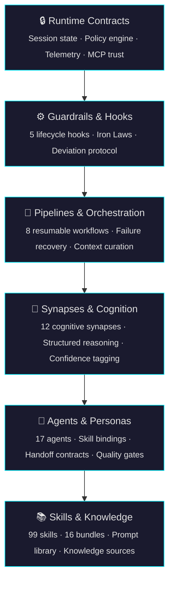
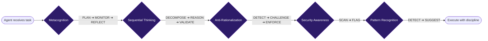
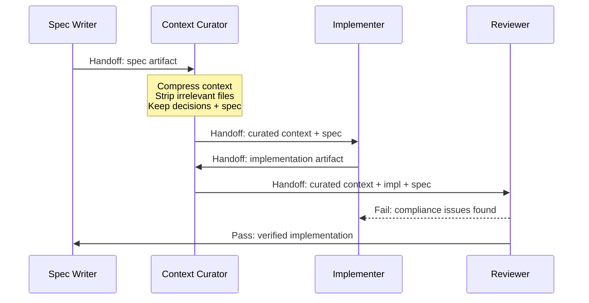
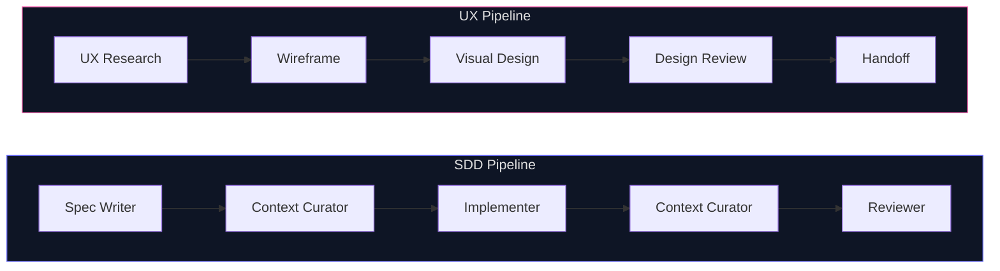

<div align="center">

<picture>
  <source media="(prefers-color-scheme: dark)" srcset="https://img.shields.io/badge/ARCHON-The_Virtuoso_Engine-00F0FF?style=for-the-badge&labelColor=0e0e0e">
  <source media="(prefers-color-scheme: light)" srcset="https://img.shields.io/badge/ARCHON-The_Virtuoso_Engine-0969DA?style=for-the-badge&labelColor=f6f8fa">
  
</picture>

<br><br>

**The cognitive kernel for Claude Code.**

<br>

[](LICENSE)
[]()
[]()


<br>

[]()
[]()

<br>

[Quick Start](#-quick-start) · [Architecture](#-architecture) · [Skills](#-skills--bundles) · [Agents](#-agents) · [Synapses](#-cognitive-synapses) · [Pipelines](#-pipelines) · [Docs](#-documentation)

</div>

---

## The Problem

Most AI agent frameworks give you plumbing — tool calling, memory, chains. None of them address the real failure mode: **agents that guess, rationalize, and skip steps.**

Archon is the first framework that treats agent discipline as a first-class concern. It ships 98 skills as a native Claude Code plugin, but the real value is what happens _between_ skills: cognitive synapses that force structured reasoning, guardrails with Iron Laws agents cannot talk their way out of, and resumable pipelines that recover from failure instead of crashing.

> [!IMPORTANT]
> Archon is not another LangChain. It does not manage LLM calls, memory, or tool routing.
> It manages **what agents know** (skills), **how agents think** (synapses), and **what agents must never do** (guardrails).

---

## ⚡ Quick Start

```bash
git clone https://github.com/SufficientDaikon/archon.git
cd archon
pip install -e .
```

```bash
archon init                                   # Initialize Archon for Claude Code
archon doctor                                 # Verify everything works
archon install --all                          # Deploy all 98 skills
archon install --bundle godot-kit             # Just one domain
archon install --skill backend-development    # Just one skill
```

Run a full pipeline:

```bash
archon pipeline run sdd-pipeline --project ./myapp
```

> [!TIP]
> `archon doctor` validates your environment, checks skill integrity, and reports any manifest issues — run it after every install.

---

## 🏗 Architecture

Archon uses a strict 6-layer architecture. Each layer builds on the one below. No shortcuts, no bypasses.



<details>
<summary><strong>Directory structure</strong></summary>

```
archon/
├── skills/          98 skills (SKILL.md + manifest.yaml + resources/)
├── bundles/         16 domain bundles (bundle.yaml + conflict resolution)
├── agents/          17 agent definitions (AGENT.md + agent-manifest.yaml)
├── pipelines/       8 multi-agent workflows (resumable YAML)
├── synapses/        12 cognitive synapses (SYNAPSE.md + manifest.yaml)
├── hooks/           5 lifecycle hooks
├── src/             Core engine (session, policy, telemetry, replay)
├── sdk/             Python SDK
├── mcp-servers/     MCP server integrations
├── vscode/          VS Code extension
├── webapp/          Web application
├── schemas/         15 validation schemas
└── tests/           513 automated tests
```

</details>

Skills are installed directly into `~/.claude/skills/` and are immediately available to Claude Code sessions. The built-in VS Code extension provides skill browsing, pipeline visualization, and agent card inspection without leaving your editor.

---

## 🧠 Cognitive Synapses

This is what makes Archon different. Synapses don't add knowledge — they shape **how agents reason**. Core synapses fire automatically. Agents cannot opt out.



| Synapse                  | Type | Phases                                                                                 | Purpose                                                               |
| :----------------------- | :--- | :------------------------------------------------------------------------------------- | :-------------------------------------------------------------------- |
| **Metacognition**        | Core | <kbd>PLAN</kbd> → <kbd>MONITOR</kbd> → <kbd>REFLECT</kbd>                              | Agents plan before acting, tag confidence levels, reflect on outcomes |
| **Anti-Rationalization** | Core | <kbd>DETECT</kbd> → <kbd>CHALLENGE</kbd> → <kbd>ENFORCE</kbd>                          | 10 Iron Laws prevent agents from making excuses to skip steps         |
| **Sequential Thinking**  | Core | <kbd>DECOMPOSE</kbd> → <kbd>REASON</kbd> → <kbd>VALIDATE</kbd> → <kbd>SYNTHESIZE</kbd> | Forces step-by-step decomposition instead of "just do it"             |
| **Pattern Recognition**  | Core | <kbd>DETECT</kbd> → <kbd>SUGGEST</kbd> → <kbd>APPLY</kbd>                              | Surfaces matching skills for detected code/design patterns            |
| **Security Awareness**   | Core | <kbd>SCAN</kbd> → <kbd>FLAG</kbd>                                                      | Injects OWASP security checks during every code task                  |

<details>
<summary><strong>The 10 Iron Laws of Anti-Rationalization</strong></summary>

An agent under Archon's guardrails **cannot**:

1. Skip a required step by claiming "it's obvious"
2. Omit tests by saying "the code is simple enough"
3. Ignore a failing check by promising to "fix it later"
4. Substitute a quick fix for a proper investigation
5. Claim something is "out of scope" without citing the spec
6. Override a guardrail by asserting expertise
7. Merge work that violates a quality gate
8. Produce output without tagging its confidence level
9. Skip context curation between pipeline phases
10. Self-assess as "done" without running the reviewer

Violations trigger the **Deviation Protocol**: halt → explain → get explicit override or fix.

</details>

---

## 📚 Skills & Bundles

98 skills organized into 16 domain bundles. Each skill follows a standardized format: `SKILL.md` (instructions) + `manifest.yaml` (metadata) + optional `resources/` and `references/`.

<details open>
<summary><strong>All 16 Bundles</strong></summary>

| Bundle                                                                         | Skills | Domain              | Key Capabilities                                           |
| :----------------------------------------------------------------------------- | :----: | :------------------ | :--------------------------------------------------------- |
|          |   5    | Godot 4 / GDScript  | Best practices, debugging, particles, patterns, meta-skill |
|       |   10   | Frontend / Backend  | React, RSC, i18n, backend APIs, Vercel patterns            |
|     |   7    | UX Design Pipeline  | Research → wireframe → visual → interaction → test         |
|         |   4    | Django / Python     | Framework, ORM, REST APIs, expert patterns                 |
|            |   6    | Spec-Driven Dev     | Spec → implement → review → debug lifecycle                |
|        |   5    | Quality Assurance   | Unit, E2E, QA planning, debugging, webapp testing          |
|         |   2    | Mobile Apps         | Mobile design doctrine, Capacitor best practices           |
|           |   5    | Skill Authoring     | Create, discover, package, index, and upgrade skills       |
|  |   17   | Plugin System       | Prompts, quality gates, webhooks, SDK, Claude plugins      |
|       |   4    | AppSec              | Guard chain, webhooks, error handling, logging             |
|    |   4    | Data & ORM          | Prisma, singletons, deduplication patterns                 |
|         |   4    | Infrastructure      | Docker, container ops, structured logging                  |
|        |   3    | Windows Admin       | Crash debugging, network optimization, registry            |
|  |   3    | Agent Orchestration | Complexity routing, context curation, deep research        |
|            |   2    | GitHub Workflow     | Markdown mastery, PR quality enforcement                   |
|       |   4    | Education           | Adaptive teaching, codebase/paper/PR → interactive courses |

</details>

<details>
<summary><strong>Skill anatomy</strong></summary>

Every skill follows this structure:

```
skills/backend-development/
├── SKILL.md           # Full instructions the agent follows
├── manifest.yaml      # Metadata: name, version, tags, triggers
└── resources/         # Templates, schemas, reference docs
    ├── api-template.md
    └── db-patterns.md
```

The `manifest.yaml` declares everything the framework needs:

```yaml
name: backend-development
version: 1.0.0
description: "Backend API design, database architecture, microservices"
author: tahaa
license: MIT
tags: [backend, api, database, architecture]
triggers:
  - pattern: "design.*api"
  - pattern: "database.*schema"
priority: P1
```

</details>

---

## 🤖 Agents

17 agents with formal personas, strict guardrail enforcement, skill bindings, and handoff contracts. Every agent operates under all 12 cognitive synapses.

| Agent                        | Role                    | Skills                                                                       | Specialty                                                                                   |
| :--------------------------- | :---------------------- | :--------------------------------------------------------------------------- | :------------------------------------------------------------------------------------------ |
| `spec-writer-agent`          | Specification Architect | spec-writer, prompt-architect                                                | Transforms ideas into implementable specs                                                   |
| `implementer-agent`          | Implementation Engineer | implementer                                                                  | Builds from specs with test-driven discipline                                               |
| `reviewer-agent`             | Compliance Reviewer     | reviewer                                                                     | Verifies implementation against spec                                                        |
| `debugger-agent`             | Debug Investigator      | systematic-debugging                                                         | Root-cause analysis, never guess-and-check                                                  |
| `context-curator-agent`      | Context Architect       | context-curator                                                              | Manages context windows between pipeline phases                                             |
| `dissector-agent`            | Codebase Analyst        | knowledge-sources                                                            | Reverse-engineers codebases into skills                                                     |
| `ux-research-agent`          | UX Researcher           | ux-research                                                                  | Personas, journey maps, competitive analysis                                                |
| `ui-design-agent`            | Visual Designer         | ui-visual-design, frontend-design                                            | Design systems, component libraries, hero sections                                          |
| `qa-master-agent`            | QA Engineer             | e2e-testing, qa-test-planner                                                 | Test plans, regression suites, bug reports                                                  |
| `security-reviewer-agent`    | Security Auditor        | guard-chain, error-handling                                                  | OWASP review, threat modeling, secure patterns                                              |
| `university-professor-agent` | Adaptive Professor      | adaptive-teacher, codebase-to-course, research-paper-to-course, pr-to-course | Harvard/MIT-caliber teaching with ADHD-friendly pedagogy and anti-hallucination logic gates |

> [!NOTE]
> The `university-professor-agent` includes 5 anti-hallucination logic gates (Source Verification, Confidence Rating, Numerical Accuracy, Claim Strength, Feynman Gate) that block the agent from ever guessing or fabricating information during teaching.

<details>
<summary><strong>Agent handoff protocol</strong></summary>

Agents don't "call" each other — they hand off through a structured contract:



Every handoff includes: artifact type, confidence level, and a manifest of what was included/excluded.

</details>

---

## 🔄 Pipelines

8 resumable multi-agent pipelines. If interrupted mid-execution, they save state and continue from the last completed step. No lost work, no manual restarts.



| Pipeline               | Trigger                          | Agent Flow                                       |
| :--------------------- | :------------------------------- | :----------------------------------------------- |
| **sdd-pipeline**       | "build feature X from scratch"   | spec → curate → implement → curate → review      |
| **ux-pipeline**        | "design feature X"               | research → wireframe → visual → review → handoff |
| **debug-pipeline**     | "fix bug X"                      | debug → curate → implement → test → review       |
| **skill-factory**      | "create a new skill for X"       | prompt → spec → implement → validate → review    |
| **full-product**       | "build product X end-to-end"     | ux-pipeline → sdd-pipeline → testing             |
| **dissect-to-skill**   | "dissect codebase X into skills" | dissect → diff → specify → implement → validate  |
| **skill-upgrade**      | "upgrade skill X"                | assess → specify → rewrite → verify              |
| **batch-sdd-pipeline** | "batch process multiple specs"   | queue → sdd-pipeline × N → aggregate             |

<details>
<summary><strong>Failure recovery</strong></summary>

When a pipeline step fails:

1. **State is saved** — which step, what artifacts were produced, what context was active
2. **Failure is classified** — transient (retry), permanent (escalate), or quality (fix + retry)
3. **Recovery runs** — the failed step re-executes with the failure context injected
4. **Max 3 retries** — after which the pipeline halts and surfaces the exact failure to the operator

```bash
archon pipeline resume sdd-pipeline --session abc123
```

</details>

---

## 🔒 Guardrails

Guardrails are not suggestions. They are enforcement mechanisms that agents **cannot bypass, disable, or rationalize away.**

<dl>
  <dt><strong>Iron Laws</strong></dt>
  <dd>10 inviolable rules enforced by the Anti-Rationalization synapse. Violations trigger automatic halt + deviation protocol.</dd>

  <dt><strong>Lifecycle Hooks</strong></dt>
  <dd>5 hooks that fire at key moments: pre-execution, post-execution, pre-handoff, post-handoff, on-failure. Each can block, warn, or transform.</dd>

  <dt><strong>Confidence Tagging</strong></dt>
  <dd>Every agent output is tagged with a confidence level. Agents cannot self-assess as HIGH without meeting specific evidence thresholds.</dd>

  <dt><strong>Deviation Protocol</strong></dt>
  <dd>When an agent wants to skip a step or override a guardrail: halt → explain deviation → receive explicit override from operator or fix the issue. No silent skips.</dd>

  <dt><strong>Quality Gates</strong></dt>
  <dd>Pipeline phases cannot hand off to the next agent until the quality gate passes. Spec must be complete. Implementation must match spec. Review must confirm compliance.</dd>
</dl>

---

## 📖 Documentation

| Guide                                            | Description                                             |
| :----------------------------------------------- | :------------------------------------------------------ |
| [Getting Started](docs/getting-started.md)       | Installation, setup, first skill                        |
| [Creating Skills](docs/creating-skills.md)       | Skill anatomy, `SKILL.md` authoring, manifest reference |
| [Creating Bundles](docs/creating-bundles.md)     | Domain kits with conflict resolution routing            |
| [Creating Agents](docs/creating-agents.md)       | Personas, skill bindings, guardrails, handoff protocols |
| [Creating Pipelines](docs/creating-pipelines.md) | Multi-agent workflows with branching + failure recovery |
| [Creating Synapses](docs/creating-synapses.md)   | Custom cognitive capabilities                           |
| [Architecture](docs/architecture.md)             | 6-layer design, data flow, validation schemas           |
| [Guardrails](docs/guardrails.md)                 | Iron Laws, deviation protocol, confidence tagging       |
| [CLI Guide](docs/cli-guide.md)                   | Full command reference                                  |
| [VS Code Extension](docs/vscode-extension.md)    | Extension setup, skill browser, pipeline visualization  |
| [FAQ](docs/faq.md)                               | Common questions                                        |

---

## CLI Reference

<details>
<summary><strong>All commands</strong></summary>

| Command                          | Description                                                |
| :------------------------------- | :--------------------------------------------------------- |
| `archon init`                    | Initialize Archon for Claude Code                          |
| `archon doctor`                  | Validate environment and skill integrity                   |
| `archon install --all`           | Install all 98 skills                                      |
| `archon install --bundle <name>` | Install a domain bundle                                    |
| `archon install --skill <name>`  | Install a single skill                                     |
| `archon search <query>`          | Search skills by name, tag, or domain                      |
| `archon info <skill>`            | Show skill details and manifest                            |
| `archon validate`                | Validate all manifests and skill structures                |
| `archon pipeline run <name>`     | Execute a multi-agent pipeline                             |
| `archon pipeline resume <name>`  | Resume an interrupted pipeline                             |
| `archon pipeline list`           | List available pipelines                                   |
| `archon admin stats`             | Show framework statistics                                  |
| `archon cards <agent>`           | Display an agent's card (capabilities, skills, guardrails) |

</details>

---

## Comparison

| Capability               | LangChain | CrewAI  | AutoGen |       <mark>Archon</mark>       |
| :----------------------- | :-------: | :-----: | :-----: | :-----------------------------: |
| Native Claude Code plugin |     —     |    —    |    —    |    ✅ Built for Claude Code     |
| VS Code extension        |     —     |    —    |    —    |   ✅ Skill browser + pipeline   |
| Cognitive synapses       |     —     |    —    |    —    |          ✅ 5 synapses          |
| Anti-rationalization     |     —     |    —    |    —    |         ✅ 10 Iron Laws         |
| Resumable pipelines      |     —     | Partial | Partial |     ✅ Full state recovery      |
| Guardrail enforcement    |  Partial  | Partial |    —    |      ✅ Cannot be bypassed      |
| Agent handoff contracts  |     —     |  Basic  |  Basic  |       ✅ Formal protocol        |
| Confidence tagging       |     —     |    —    |    —    |         ✅ Every output         |
| Skill validation schemas |     —     |    —    |    —    |          ✅ 15 schemas          |
| Domain bundles           |     —     |    —    |    —    |          ✅ 16 bundles          |
| Built-in teaching agent  |     —     |    —    |    —    | ✅ ADHD-friendly, 5 logic gates |

> [!CAUTION]
> Archon is **not** a replacement for LangChain/CrewAI/AutoGen. Those frameworks manage LLM orchestration (tool calling, memory, chains). Archon manages **agent discipline** (skills, reasoning, guardrails). They are complementary — you can use Archon skills inside agents built with any orchestration framework.

---

## Contributing

See [CONTRIBUTING.md](CONTRIBUTING.md) for guidelines on adding skills, bundles, agents, pipelines, synapses, and hooks.

```bash
archon validate  # Run before submitting — all manifests must pass
```

---

<div align="center">

**MIT License** · Built by [Ahmed Taha](https://github.com/SufficientDaikon)

<sub>98 skills · 17 agents · 5 synapses · 8 pipelines · 16 bundles · 513 tests · Claude Code native</sub>

</div>
