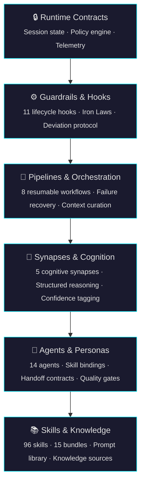
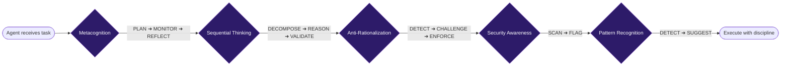
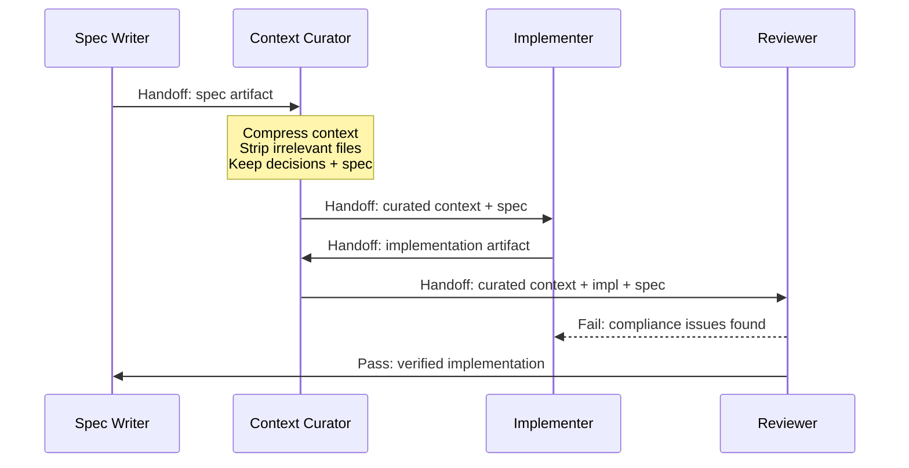

<div align="center">

<picture>
  <source media="(prefers-color-scheme: dark)" srcset="https://img.shields.io/badge/ARCHON-Agent_discipline_for_Claude_Code-00F0FF?style=for-the-badge&labelColor=0e0e0e">
  <source media="(prefers-color-scheme: light)" srcset="https://img.shields.io/badge/ARCHON-Agent_discipline_for_Claude_Code-0969DA?style=for-the-badge&labelColor=f6f8fa">
  
</picture>

<br>

**Claude Code is smart. It is also perfectly willing to skip your test suite.**

Archon keeps it honest: skills for what the agent knows,
guardrails for what it's never allowed to do, and pipelines that survive interruptions.

<br>

[](LICENSE)
[]()
[]()


<br>

[Why Archon](#why-archon-exists) · [Quick Start](#-quick-start) · [Architecture](#-architecture) · [Synapses](#-cognitive-synapses) · [Agents](#-agents) · [Pipelines](#-pipelines) · [Docs](#-docs)

</div>

---

## Why Archon exists

Framework discussion usually centers on plumbing — tool calling, memory, chains. That's not where agents actually fail. Left unsupervised, an agent will:

- ignore a failing check and "come back to it later"
- declare a feature done without running the reviewer
- invent context instead of admitting uncertainty
- refactor things you never asked it to touch

LangChain can't stop this, because it manages LLM calls, not behavior. Archon exists specifically to stop it. It's a native Claude Code plugin that wraps every task in enforcement: structured reasoning before action, rules the agent cannot argue its way out of, and multi-step workflows that checkpoint their state so a crash costs you nothing.

> [!IMPORTANT]
> Archon is not an orchestrator. It does not manage LLM calls, memory, or tool routing. It manages **what agents know** (skills), **how they reason** (synapses), and **what they must never do** (guardrails).

---

## ⚡ Quick Start

```bash
git clone https://github.com/SufficientDaikon/archon.git
cd archon
pip install -e .

archon init                # set up Claude Code integration
archon doctor              # verify the install
archon install --all       # deploy all 96 skills (or --bundle godot-kit / --skill backend-development)
```

Run a pipeline:

```bash
archon pipeline run sdd-pipeline --project ./myapp
```

> [!TIP]
> Run `archon doctor` after installing — it validates your environment, checks skill integrity, and reports manifest issues.

---

## 🏗 Architecture

Six layers. Each builds only on the one below it.


```mermaid
graph TD
    RT["🔒 Runtime Contracts<br><sub>Session state · Policy engine · Telemetry</sub>"]
    GH["⚙️ Guardrails & Hooks<br><sub>11 lifecycle hooks · Iron Laws · Deviation protocol</sub>"]
    PO["🔄 Pipelines & Orchestration<br><sub>8 resumable workflows · Failure recovery · Context curation</sub>"]
    SC["🧠 Synapses & Cognition<br><sub>5 cognitive synapses · Structured reasoning · Confidence tagging</sub>"]
    AP["🤖 Agents & Personas<br><sub>14 agents · Skill bindings · Handoff contracts · Quality gates</sub>"]
    SK["📚 Skills & Knowledge<br><sub>96 skills · 15 bundles · Prompt library · Knowledge sources</sub>"]

    RT --> GH --> PO --> SC --> AP --> SK

    style RT fill:#1a1a2e,stroke:#00F0FF,color:#e0e0e0
    style GH fill:#1a1a2e,stroke:#00F0FF,color:#e0e0e0
    style PO fill:#1a1a2e,stroke:#00F0FF,color:#e0e0e0
    style SC fill:#1a1a2e,stroke:#00F0FF,color:#e0e0e0
    style AP fill:#1a1a2e,stroke:#00F0FF,color:#e0e0e0
    style SK fill:#1a1a2e,stroke:#00F0FF,color:#e0e0e0
```

<details>
<summary><strong>Directory structure</strong></summary>

```
archon/
├── agents/            14 agents (AGENT.md + agent-manifest.yaml)
├── skills/            96 skills (SKILL.md + manifest.yaml)
├── bundles/           15 domain bundles (bundle.yaml + conflict resolution)
├── synapses/          5 cognitive synapses (SYNAPSE.md + manifest.yaml)
├── pipelines/         8 resumable multi-agent workflows
├── schemas/           15 validation schemas
├── hooks/             11 Claude Code lifecycle hooks
├── src/               Core engine — session state, policy engine, telemetry, replay
├── sdk/               Python SDK
├── servers/           MCP server integrations
├── file-ops-rs/       Rust file-ops daemon (rate limiting + metrics)
├── tests/             437 tests across 28 files
└── vscode-extension/  Skill browser, pipeline visualization
```

Plus `docs/`, `prompts/`, `scripts/`, `catalog/`, `webapp/`, and supporting tooling.

</details>

Skills install into `~/.claude/skills/` and are immediately available to Claude Code sessions. The bundled VS Code extension adds skill browsing, pipeline visualization, and agent card inspection.

---

## 🧠 Cognitive Synapses

Synapses change how the agent thinks, not what it knows. When triggered, they inject required phases into the reasoning process — and agents cannot opt out.


```mermaid
flowchart LR
    IN([Agent receives task]) --> MC{Metacognition}
    MC -->|PLAN ➜ MONITOR ➜ REFLECT| ST{Sequential Thinking}
    ST -->|DECOMPOSE ➜ REASON ➜ VALIDATE| AR{Anti-Rationalization}
    AR -->|DETECT ➜ CHALLENGE ➜ ENFORCE| SA{Security Awareness}
    SA -->|SCAN ➜ FLAG| PR{Pattern Recognition}
    PR -->|DETECT ➜ SUGGEST| OUT([Execute with discipline])

    style MC fill:#2d1b69,stroke:#c084fc,color:#fff
    style ST fill:#2d1b69,stroke:#c084fc,color:#fff
    style AR fill:#2d1b69,stroke:#c084fc,color:#fff
    style SA fill:#2d1b69,stroke:#c084fc,color:#fff
    style PR fill:#2d1b69,stroke:#c084fc,color:#fff
```

| Synapse | Phases | Purpose |
| :--- | :--- | :--- |
| **Metacognition** | <kbd>PLAN</kbd> → <kbd>MONITOR</kbd> → <kbd>REFLECT</kbd> | Plan before acting, tag confidence, reflect on outcomes |
| **Anti-Rationalization** | <kbd>DETECT</kbd> → <kbd>CHALLENGE</kbd> → <kbd>ENFORCE</kbd> | Enforces the 10 Iron Laws — no talking your way past requirements |
| **Sequential Thinking** | <kbd>DECOMPOSE</kbd> → <kbd>REASON</kbd> → <kbd>VALIDATE</kbd> → <kbd>SYNTHESIZE</kbd> | Step-by-step decomposition instead of "just do it" |
| **Pattern Recognition** | <kbd>DETECT</kbd> → <kbd>SUGGEST</kbd> → <kbd>APPLY</kbd> | Surfaces matching skills for detected code/design patterns |
| **Security Awareness** | <kbd>SCAN</kbd> → <kbd>FLAG</kbd> | Injects OWASP checks into every code task |

<details>
<summary><strong>The 10 Iron Laws of Anti-Rationalization</strong></summary>

An agent under Archon **cannot**:

1. Skip a required step by claiming "it's obvious"
2. Omit tests by saying "the code is simple enough"
3. Ignore a failing check by promising to "fix it later"
4. Substitute a quick fix for proper investigation
5. Declare something "out of scope" without citing the spec
6. Override a guardrail by asserting expertise
7. Merge work that violates a quality gate
8. Produce output without tagging its confidence level
9. Skip context curation between pipeline phases
10. Mark work "done" without passing review

Violating one triggers the **Deviation Protocol**: halt, explain, get explicit override from the operator — or fix it.

</details>

---

## 📚 Skills & Bundles

Every skill follows the same anatomy: `SKILL.md` (instructions), `manifest.yaml` (metadata + trigger patterns), optional `resources/`. Most skills ship grouped into domain bundles — some intentionally shared across kits (e.g., `guard-chain` powers both security-kit and web-dev-kit) — and the rest are installed individually.

<details open>
<summary><strong>All 15 bundles</strong></summary>

| Bundle | Skills | Domain |
| :--- | :---: | :--- |
|  | 5 | Godot 4 / GDScript — best practices, debugging, particles, game patterns |
|  | 9 | React, Next.js, RSC, i18n, backend APIs, Vercel performance patterns |
|  | 7 | Full UX lifecycle — research → IA → wireframe → visual → interaction → usability |
|  | 6 | Spec-driven development — spec → implement → review → design handoff |
|  | 5 | Authoring, discovering, packaging, and upgrading skills + prompt engineering |
|  | 10 | Patterns extracted from the prompts.chat codebase — plugins, quality gates, white-labeling, SDKs |
|  | 4 | Courses from codebases, papers, and PRs — ADHD-friendly, anti-fabrication guardrails |
|  | 5 | Vitest units, E2E, QA planning, webapp automation, systematic debugging |
|  | 4 | Guard chains, SSRF-safe webhooks, error architecture, structured logging |
|  | 4 | Prisma ORM, connection singletons, content dedup, API patterns on top |
|  | 2 | Docker production builds, observability via Pino |
|  | 3 | Complexity routing, context-window management, evidence-based research |
|  | 2 | Markdown/GFM mastery, PR quality auditing |
|  | 3 | BSOD crash debugging, network tuning, registry management via PowerShell |
|  | 2 | Mobile-first design doctrine, Capacitor best practices |

*Bundles cover 71 skills; the remaining ~25 install standalone via `archon install --skill`.*

</details>

<details>
<summary><strong>Skill anatomy</strong></summary>

```
skills/backend-development/
├── SKILL.md           # Instructions the agent follows
├── manifest.yaml      # Metadata: name, version, tags, triggers
└── resources/
    ├── api-template.md
    └── db-patterns.md
```

```yaml
name: backend-development
version: 1.0.0
description: "Backend API design, database architecture, microservices"
tags: [backend, api, database, architecture]
triggers:
  - pattern: "design.*api"
  - pattern: "database.*schema"
priority: P1
```

</details>

---

## 🤖 Agents

Each agent is a formal persona with skill bindings, guardrail exposure, and structured handoff contracts. Every agent operates under all five synapses.

| Agent | Role | What it does |
| :--- | :--- | :--- |
| `spec-writer-agent` | Specification Architect | Turns ambiguous ideas into specs with testable acceptance criteria |
| `implementer-agent` | Implementation Engineer | Executes specs section-by-section with TDD precision |
| `reviewer-agent` | Compliance Reviewer | Evidence-based verification of implementation against spec |
| `debugger-agent` | Debug Investigator | Four-phase root-cause framework — investigation before fixes |
| `context-curator-agent` | Context Architect | Distills artifacts into role-aware briefs; every handoff gets what it needs, nothing more |
| `design-agent` | Unified Design Architect | Generates, applies, and audits `DESIGN.md` — one agent covering the entire design lifecycle |
| `dissector-agent` | Codebase Reverse Engineer | 13-phase analysis producing architecture maps, pattern catalogs, and API references |
| `prompt-architect-agent` | Prompt Structure Designer | Designs skill prompt frameworks with trigger patterns and structural scaffolding |
| `skill-validator-agent` | Skill Quality Validator | Schema gate for contributions: manifest completeness, structure, trigger coverage |
| `qa-master-agent` | QA Engineer | E2E suites, test plans, systematic webapp validation |
| `security-reviewer-agent` | Security Reviewer | OWASP Top 10 audits, injection vectors, insecure-pattern detection |
| `ux-research-agent` | UX Researcher | Personas, journey mapping, competitive analysis |
| `ux-lifecycle-master-agent` | UX Pipeline Orchestrator | Drives the full UX pipeline, enforcing phase gates and design continuity |
| `university-professor-agent` | Adaptive University Professor | Turns codebases, papers, and PRs into interactive courses |

> [!NOTE]
> `design-agent` (v2.0.0) replaced four separate design agents — ui-design, wireframe, design-handoff, and design-review — consolidating their capabilities as loadable skills. One agent, fewer handoffs, no dropped context.

<details>
<summary><strong>The professor's anti-hallucination gates</strong></summary>

The `university-professor-agent` refuses to answer through five sequential gates:

1. **Source Verification** — no claim without a source
2. **Confidence Rating** — uncertainty stated explicitly
3. **Numerical Accuracy** — numbers re-checked against source
4. **Claim Strength** — strong conclusions require strong evidence
5. **Feynman Gate** — if it can't explain it simply, it flags a knowledge gap instead of bluffing

</details>

<details>
<summary><strong>Handoff protocol</strong></summary>

Agents don't call each other — they hand off through structured contracts. Every handoff declares the artifact type, confidence level, and exactly what context was included/excluded:


```mermaid
sequenceDiagram
    participant S as Spec Writer
    participant CC as Context Curator
    participant I as Implementer
    participant R as Reviewer

    S->>CC: Handoff: spec artifact
    Note over CC: Compress context<br>Strip irrelevant files<br>Keep decisions + spec
    CC->>I: Handoff: curated context + spec
    I->>CC: Handoff: implementation artifact
    CC->>R: Handoff: curated context + impl + spec
    R-->>I: Fail: compliance issues found
    R->>S: Pass: verified implementation
```

</details>

---

## 🔄 Pipelines

Eight multi-agent workflows, all resumable. If a pipeline dies mid-run it saves state — completed steps stay done, and you resume from where it stopped:

```bash
archon pipeline resume sdd-pipeline --session abc123
```

<details open>
<summary><strong>Available pipelines</strong></summary>

| Pipeline | You say | Flow |
| :--- | :--- | :--- |
| **sdd-pipeline** | "build feature X from scratch" | spec → curate → implement → curate → review |
| **ux-pipeline** | "design feature X" | research → wireframe → visual → review → handoff |
| **debug-pipeline** | "fix bug X" | debug → curate → implement → test → review |
| **skill-factory** | "create a new skill for X" | prompt → spec → implement → validate → review |
| **full-product** | "build product X end-to-end" | ux-pipeline → sdd-pipeline → testing |
| **dissect-to-skill** | "dissect codebase X into skills" | dissect → diff → specify → implement → validate |
| **skill-upgrade** | "upgrade skill X" | assess → specify → rewrite → verify |
| **batch-sdd-pipeline** | "batch process multiple specs" | queue → sdd-pipeline × N → aggregate |

</details>

<details>
<summary><strong>Failure recovery</strong></summary>

When a step fails:

1. State is saved — step, artifacts produced, active context
2. The failure is classified: transient (retry), permanent (escalate), or quality (fix + retry)
3. Recovery reruns the failed step with the failure context injected
4. After 3 retries the pipeline halts and surfaces the exact failure

</details>

---

## 🔒 Guardrails

Guardrails aren't suggestions. Agents cannot bypass, disable, or argue their way around them.

<dl>
  <dt><strong>Iron Laws</strong></dt>
  <dd>Ten rules enforced by the Anti-Rationalization synapse. Violations halt the run and open the deviation protocol.</dd>

  <dt><strong>Lifecycle hooks</strong></dt>
  <dd>Eleven hooks fire at key moments across execution, handoff, and failure paths. Each can block, warn, or transform.</dd>

  <dt><strong>Confidence tagging</strong></dt>
  <dd>Every output carries a confidence level gated by evidence thresholds. Saying "HIGH" isn't enough — you have to earn it.</dd>

  <dt><strong>Deviation protocol</strong></dt>
  <dd>To skip a step, the agent must halt, explain why, and receive explicit override from the operator. There is no silent path.</dd>

  <dt><strong>Quality gates</strong></dt>
  <dd>A phase can't hand off until its gate passes: spec complete, implementation matches spec, review confirms compliance.</dd>
</dl>

---

## How it compares

LangChain, CrewAI, and AutoGen orchestrate LLM calls — routing, memory, chains. Archon operates at a different layer: it constrains agent *behavior*. The two compose — Archon guardrails work inside agents built on any orchestration framework.

Short version: **they decide which model to call; Archon decides whether the agent is allowed to skip the tests.**

---

## 📖 Docs

| Guide | Covers |
| :--- | :--- |
| [Getting Started](docs/getting-started.md) | Installation, setup, first skill |
| [Creating Skills](docs/creating-skills.md) | SKILL.md authoring, manifest reference |
| [Creating Bundles](docs/creating-bundles.md) | Domain kits, conflict-resolution routing |
| [Creating Agents](docs/creating-agents.md) | Personas, bindings, handoff protocols |
| [Creating Pipelines](docs/creating-pipelines.md) | Workflows, branching, failure recovery |
| [Creating Synapses](docs/creating-synapses.md) | Custom cognitive capabilities |
| [Architecture](docs/architecture.md) | 6-layer design, data flow, schemas |
| [Guardrails](docs/guardrails.md) | Iron Laws, deviation protocol, confidence tagging |
| [CLI Guide](docs/cli-guide.md) | Full command reference |
| [VS Code Extension](docs/vscode-extension.md) | Skill browser, pipeline visualization |
| [FAQ](docs/faq.md) | Common questions |

---

## CLI Reference

<details>
<summary><strong>All commands</strong></summary>

| Command | Description |
| :--- | :--- |
| `archon init` | Initialize Archon for Claude Code |
| `archon doctor` | Validate environment and skill integrity |
| `archon install --all` | Install all skills |
| `archon install --bundle <name>` | Install a domain bundle |
| `archon install --skill <name>` | Install a single skill |
| `archon search <query>` | Search skills by name, tag, or domain |
| `archon info <skill>` | Show skill details and manifest |
| `archon validate` | Validate all manifests and structures |
| `archon pipeline run <name>` | Execute a pipeline |
| `archon pipeline resume <name>` | Resume an interrupted pipeline |
| `archon pipeline list` | List available pipelines |
| `archon admin stats` | Show framework statistics |
| `archon cards <agent>` | Display an agent card |

</details>

---

## Contributing

See [CONTRIBUTING.md](CONTRIBUTING.md). Adding skills, bundles, agents, pipelines, synapses, or hooks all follow the same rule:

```bash
archon validate  # must pass before submitting
```

The [`skill-validator-agent`](#-agents) acts as the automated quality gate for new skills — submit and it checks manifest completeness, structure, and trigger coverage for you.

---

<div align="center">

**MIT License** · Built by [Ahmed Taha](https://github.com/SufficientDaikon)

<sub>For everyone tired of typing "actually run the tests."</sub>

</div>
