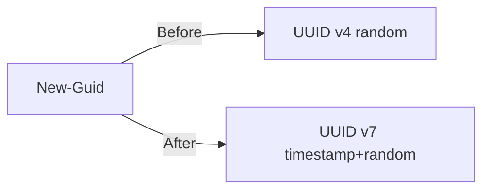

# GitHub Markdown Mastery

## Overview

Complete reference for maximizing visual communication within GitHub's Markdown renderer. Covers everything GitHub supports — GFM syntax, Mermaid diagrams, LaTeX math, alerts, shields.io badges, dark-mode images, and the 63 allowed HTML elements — plus what gets stripped and how to work around it.

## When to Use

- Writing or improving PR descriptions, README files, issue bodies, or comments
- Adding visual elements (diagrams, badges, callouts, flow charts) to GitHub content
- Need to know if a specific HTML tag, attribute, or feature works on GitHub
- Designing information-rich layouts within GitHub's sanitizer constraints
- Combining multiple features for maximum clarity (alerts + tables + badges + collapsible sections)

## Quick Reference: What Works Where

| Feature | .md files | Issues/PRs | Comments | Wiki |
|---------|-----------|------------|----------|------|
| Basic Markdown | Y | Y | Y | Y |
| Tables | Y | Y | Y | Y |
| Task lists | Y | Y | Y | Y |
| Mermaid diagrams | Y | Y | Y | Y |
| Math/LaTeX | Y | Y | Y | Y |
| Alerts (NOTE/TIP/etc) | Y | Y | Y | Y |
| Footnotes | Y | Y | Y | **No** |
| `<details>` collapsible | Y | Y | Y | Y |
| Color swatches | **No** | Y | Y | -- |
| `#123` autolinks | **No** | Y | Y | **No** |
| @mentions | -- | Y | Y | -- |
| `suggestion` blocks | -- | PR reviews only | -- | -- |
| GeoJSON/STL rendering | Y | Y | -- | Y |

## What Gets Stripped (Do NOT Use)

| Stripped | Use Instead |
|---------|-------------|
| `<style>` | Badges, structural HTML, alerts |
| `<script>` | No JS possible on GitHub |
| `<iframe>` | Link externally |
| `class="..."` | Stripped — no custom CSS classes |
| `style="..."` | Stripped — use `align`, `width`, badges |
| `<form>`, `<input>` | Task lists `- [ ]` |
| `<video>` autoplay | GIF or linked video |
| `onclick`, event handlers | No interactivity |
| `<mark>` | **Actually works** (it's in the 63 allowed) |
| CSS Grid/Flexbox | `<table>` or `<div align>` |

9 tags explicitly neutralized by GFM spec: `<title>`, `<textarea>`, `<style>`, `<xmp>`, `<iframe>`, `<noembed>`, `<noframes>`, `<script>`, `<plaintext>`

## GitHub Alerts (Callouts)

```markdown
> [!NOTE]
> Informational highlight — renders blue.

> [!TIP]
> Helpful advice — renders green.

> [!IMPORTANT]
> Key information — renders purple.

> [!WARNING]
> Potential problems — renders yellow.

> [!CAUTION]
> Dangerous actions — renders red.
```

5 types. Cannot be nested. Avoid stacking consecutively.

## Collapsible Sections

```markdown
<details>
<summary>Click to expand</summary>

Markdown renders inside. **Bold**, `code`, tables — all work.
Blank line after `</summary>` is required for Markdown to render.

</details>
```

Nest them for progressive disclosure:

```markdown
<details>
<summary>Outer section</summary>

<details>
<summary>Inner section</summary>

Nested content here.

</details>
</details>
```

Use `<details open>` for default-expanded.

## Shields.io Badges

```markdown

```

**URL encoding:** `_` = space, `__` = literal underscore, `--` = literal dash, `%20` = space

**Named colors:** `brightgreen`, `green`, `yellowgreen`, `yellow`, `orange`, `red`, `blue`, `lightgrey`, `blueviolet` — also hex without `#`: `ff69b4`

**Styles:** `?style=flat` (default), `flat-square`, `plastic`, `for-the-badge`, `social`

**Logos:** `?logo=github&logoColor=white` — slugs from [simpleicons.org](https://simpleicons.org)

```markdown


```

**Dynamic badges** (live data):

```markdown


```

See `badges-reference.md` for full parameter reference and all dynamic endpoints.

## Mermaid Diagrams

Native rendering — no images needed. Wrap in ` ```mermaid ` code fence.

### Flowchart (most useful for PRs)

```
flowchart LR
    A[Input] --> B{Decision?}
    B -->|Yes| C[Action]
    B -->|No| D[Skip]
```

Directions: `TD` (top-down), `LR` (left-right), `BT`, `RL`

### Sequence Diagram

```
sequenceDiagram
    Client->>Server: Request
    Server-->>Client: Response
```

### State Diagram

```
stateDiagram-v2
    [*] --> Open
    Open --> Closed: close()
    Closed --> [*]
```

### Pie Chart

```
pie title Distribution
    "Category A" : 60
    "Category B" : 30
    "Category C" : 10
```

### Git Graph

```
gitGraph
    commit
    branch feature
    commit
    checkout main
    merge feature
```

**Confirmed working on GitHub:** Flowchart, Sequence, Class, State, ER, Gantt, Pie, Git Graph, User Journey, Mindmap, Timeline, Requirement.

**Likely working (v10+):** Quadrant, Sankey (`sankey-beta`), XY Chart (`xychart-beta`), Block (`block-beta`), C4.

**Does NOT work:** ZenUML, click interactivity, Font Awesome icons, ELK layout.

See `mermaid-reference.md` for all 20+ diagram types with examples.

## Math / LaTeX

Rendered via MathJax. Inline: `$E = mc^2$`. Block:

```markdown
$$
\sum_{i=1}^{n} x_i = x_1 + x_2 + \cdots + x_n
$$
```

Or use ` ```math ` code fence for block math. Dollar-backtick `` $`expr`$ `` avoids conflicts with Markdown syntax.

## Dark-Mode-Aware Images

```html
<picture>
  <source media="(prefers-color-scheme: dark)" srcset="dark-version.svg">
  <source media="(prefers-color-scheme: light)" srcset="light-version.svg">
  
</picture>
```

Commit SVGs to your branch — they render inline in PR bodies via raw.githubusercontent.com URLs.

## HTML That Works (63 Allowed Elements)

Most useful subset:

| Element | Use For | Example |
|---------|---------|---------|
| `<details><summary>` | Collapsible | See above |
| `<kbd>` | Keyboard keys | `<kbd>Ctrl</kbd>+<kbd>C</kbd>` |
| `<sub>`, `<sup>` | Sub/superscript | H`<sub>`2`</sub>`O |
| `<ins>`, `<del>` | Added/removed text | `<ins>`new`</ins>` `<del>`old`</del>` |
| `<div align="center">` | Center content | Center images, headings |
| `<table>` | Complex tables | `colspan`, `rowspan` (MD tables cannot) |
| `` | Sized images | `` |
| `<dl><dt><dd>` | Definition lists | Term → definition pairs |
| `<abbr title="...">` | Abbreviations | Hover for full text |
| `<mark>` | Highlighting | Yellow highlight |
| `<ruby><rt>` | Annotations | CJK pronunciation guides |
| `<br>` | Line break | Force break within paragraph |
| `<figure><figcaption>` | Captioned images | Image with caption |

**Allowed global attributes** on all 63 elements: `align`, `width`, `height`, `colspan`, `rowspan`, `id`, `role`, `aria-*`, `title`, `open`, `lang`, `dir`, and more.

**NOT allowed:** `class`, `style`, `onclick`/event handlers.

## Diff Code Blocks

```markdown
` ` `diff
- old line (renders red)
+ new line (renders green)
  unchanged line
` ` `
```

Great for before/after comparisons in PRs.

## Color Swatches (Issues/PRs Only)

Inline backtick colors render as visual swatches:

```markdown
`#0969DA` `rgb(9, 105, 218)` `hsl(212, 92%, 45%)`
```

Only works in issues, PRs, and discussions — not in .md files.

## Footnotes

```markdown
Text with a footnote[^1] and another[^note].

[^1]: First footnote.
[^note]: Named footnote.
```

Always render at bottom of document. Not supported in wikis.

## Autolinks and References

| Syntax | Renders As |
|--------|-----------|
| `#123` | Issue/PR link (same repo, conversations only) |
| `org/repo#123` | Cross-repo reference |
| `@username` | Profile link + notification |
| `SHA` (7+ chars) | Commit link |
| Bare URL | Auto-linked |

## Visual Communication Patterns

### Status Dashboard (badges + table)

```markdown
| Component | Status |
|-----------|--------|
| Build |  |
| Tests |  |
| Breaking |  |
```

### Progressive Disclosure (alert + details + table)

```markdown
> [!WARNING]
> Breaking change: default GUID version changes from v4 to v7.

<details>
<summary>Migration details</summary>

| Before | After | Impact |
|--------|-------|--------|
| `Guid.NewGuid()` | `Guid.CreateVersion7()` | Format identical |

</details>
```

### Centered Hero (README pattern)

```html
<div align="center">

# Project Name

 

**Short description.**

[Docs](url) | [Issues](url) | [Contribute](url)

</div>
```

### Before/After with Diff + Mermaid

Combine `diff` code blocks for code changes and Mermaid flowcharts for behavioral changes:

````markdown
**Code change:**
```diff
- Guid.NewGuid()
+ Guid.CreateVersion7()
```

**Behavioral change:**

````

### Keyboard Shortcuts Table

```markdown
| Action | Shortcut |
|--------|----------|
| Copy | <kbd>Ctrl</kbd>+<kbd>C</kbd> |
| Paste | <kbd>Ctrl</kbd>+<kbd>V</kbd> |
```

## PR Body Best Practices

1. **Lead with one-line summary** — what and why
2. **Alerts** for breaking changes, WG decisions, important notes
3. **Tables** for file-by-file change descriptions
4. **Diff blocks** for before/after code
5. **Mermaid** for flow/architecture changes
6. **Badges** for test results, CI status
7. **`<details>`** for verbose content (logs, full test output, long code)
8. **Task lists** for PR checklists
9. **Footnotes** for references that clutter the main text
10. **Keep critical info above the fold** — details go in collapsibles

See `pr-patterns.md` for complete PR body templates.

## Common Mistakes

| Mistake | Fix |
|---------|-----|
| `<style>` for colors | Use badges, alerts, or `diff` blocks |
| Huge inline images | `` |
| HTML table when MD works | Use pipe tables unless you need colspan |
| Missing blank line around HTML | HTML blocks need blank lines before/after |
| Markdown inside HTML without blank line | Blank line after opening tag required |
| Testing in local preview | GitHub's renderer differs — test on GitHub |
| Using `<mark>` and assuming it's stripped | It actually works (it's in the allowed list) |
| Trying `click` in Mermaid | Blocked by GitHub's iframe sandbox |
| Stacking multiple alerts | Looks cluttered — limit to 1-2 per section |

## Line Break Behavior

| Context | Newline behavior |
|---------|-----------------|
| Issues, PRs, discussions | Newline = line break |
| `.md` files | Newline ignored — use `  ` (two spaces), `\`, or `<br>` |
| All contexts | Blank line = paragraph break |
