# Mermaid Diagrams — Full Reference for GitHub

## Check GitHub's Mermaid Version

````markdown
```mermaid
info
```
````

This renders the version number. GitHub lags behind upstream Mermaid releases.

## Compatibility Tiers

| Tier | Diagram Types | Notes |
|------|--------------|-------|
| **Confirmed working** | Flowchart, Sequence, Class, State, ER, Gantt, Pie, Git Graph, User Journey, Mindmap, Timeline, Requirement | Pre-v10, long-established |
| **Very likely working** | Quadrant, Sankey (`sankey-beta`), XY Chart (`xychart-beta`), Block (`block-beta`), C4 | v10.2-10.8 |
| **Uncertain** | Packet (`packet-beta`), Architecture (`architecture-beta`) | Requires v11.0+ |
| **Unlikely on GitHub** | Kanban, Radar, Treemap, Venn, Ishikawa | Requires v11.4+ |
| **Confirmed broken** | ZenUML | Does not render at all |

**Always use `-beta` suffixes** for Sankey, XY Chart, Block, Packet, Architecture on GitHub.

## What Does NOT Work on GitHub's Mermaid

- `click` directives — blocked by iframe sandbox ("This content is blocked")
- Font Awesome icons — not loaded in GitHub's renderer
- ELK layout engine — not enabled
- External links in nodes — same sandbox restriction
- ZenUML — does not render
- `%%{init: ...}%%` directives — partial/inconsistent support

---

## All Diagram Types with Examples

### 1. Flowchart

**Keyword:** `flowchart` or `graph`

````markdown
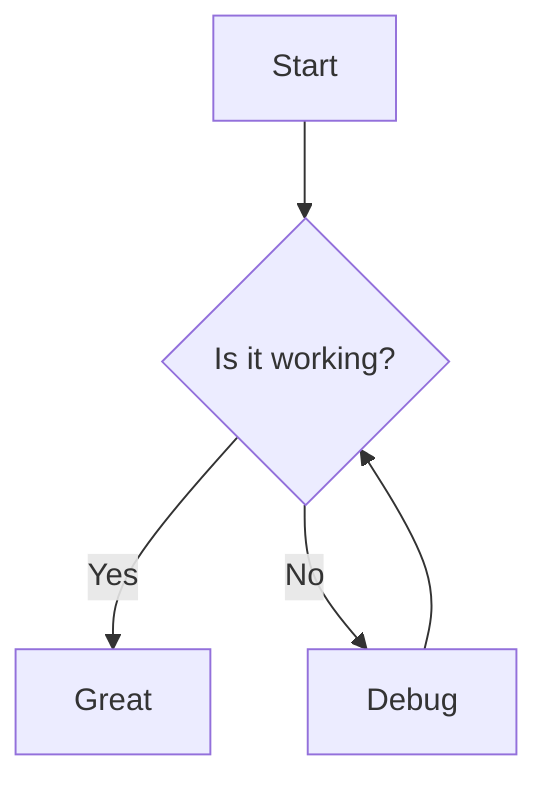
````

**Directions:** `TD`/`TB` (top-down), `LR` (left-right), `BT` (bottom-top), `RL` (right-left)

**Node shapes:**
- `[text]` — rectangle
- `(text)` — rounded
- `{text}` — diamond (decision)
- `([text])` — stadium
- `[[text]]` — subroutine
- `[(text)]` — cylinder
- `((text))` — circle
- `>text]` — asymmetric
- `{{text}}` — hexagon
- `[/text/]` — parallelogram
- `[\text\]` — reverse parallelogram
- `[/text\]` — trapezoid
- `[\text/]` — reverse trapezoid

**Arrow types:**
- `-->` — solid arrow
- `---` — solid line (no arrow)
- `-.->` — dotted arrow
- `==>` — thick arrow
- `--text-->` — labeled arrow
- `-->|text|` — labeled arrow (alt)

**Subgraphs:**
```
subgraph title
    A --> B
end
```

### 2. Sequence Diagram

**Keyword:** `sequenceDiagram`

````markdown
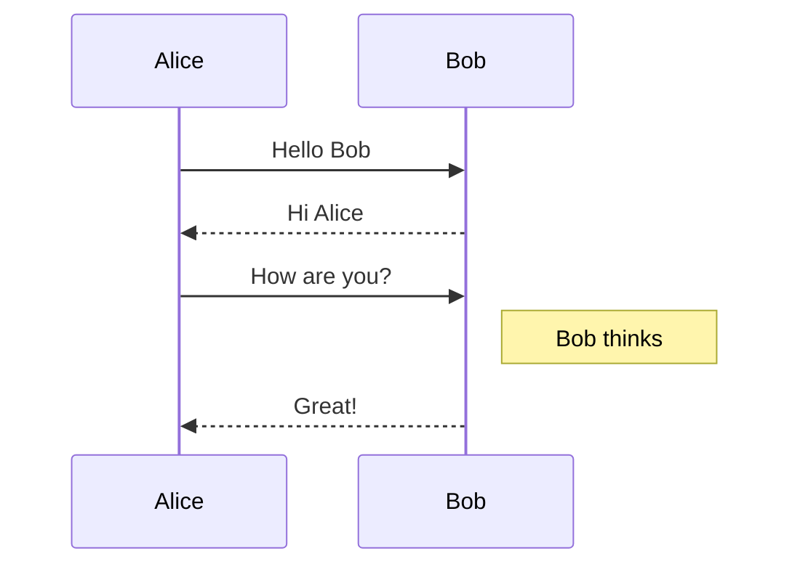
````

**Arrow types:**
- `->` — solid line (no arrowhead)
- `-->` — dotted line (no arrowhead)
- `->>` — solid line with arrowhead
- `-->>` — dotted line with arrowhead
- `-x` — solid line with cross
- `--x` — dotted line with cross
- `-)` — solid line with open arrow (async)
- `--)` — dotted line with open arrow (async)

**Features:**
- `activate`/`deactivate` or `+`/`-` suffixes on arrows
- `Note left of`/`right of`/`over` for notes
- `loop`/`alt`/`opt`/`par`/`critical`/`break`/`rect` blocks
- `autonumber` for automatic numbering
- `actor` instead of `participant` for stick figures

### 3. Class Diagram

**Keyword:** `classDiagram`

````markdown
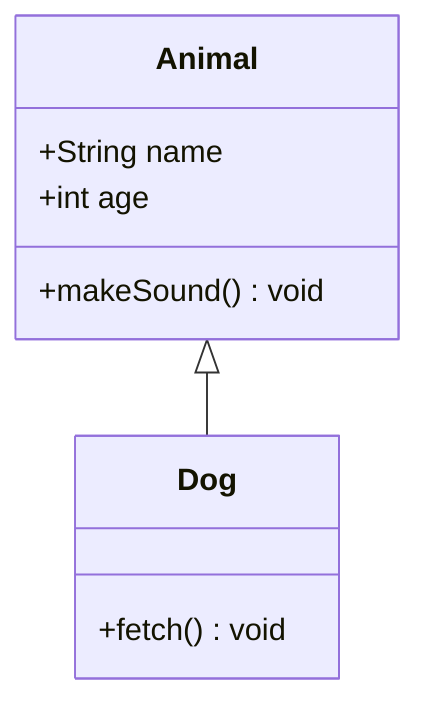
````

**Relationships:**
- `<|--` — inheritance
- `*--` — composition
- `o--` — aggregation
- `-->` — association
- `..>` — dependency
- `..|>` — realization

**Visibility:** `+` public, `-` private, `#` protected, `~` package

### 4. State Diagram

**Keyword:** `stateDiagram-v2`

````markdown
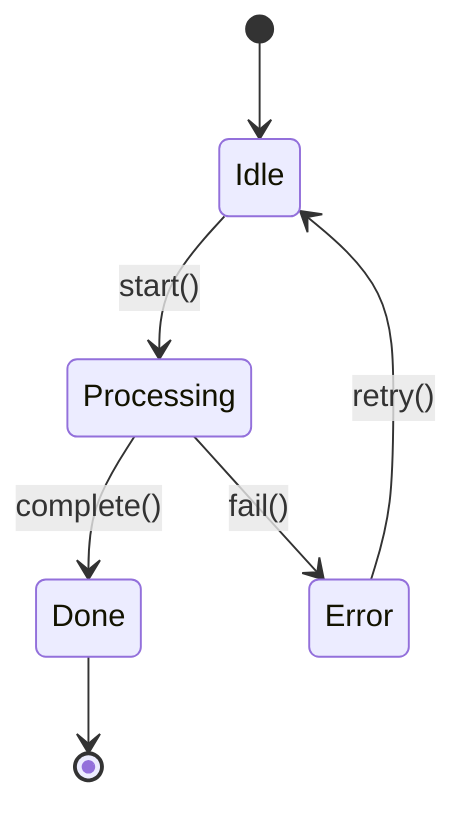
````

**Features:**
- `[*]` — start/end state
- `state "Description" as s1` — aliased states
- `--` — notes
- Composite states via nested `state Name { ... }`
- `<<fork>>` and `<<join>>` for concurrent states
- `<<choice>>` for conditional branching

### 5. Entity Relationship Diagram

**Keyword:** `erDiagram`

````markdown
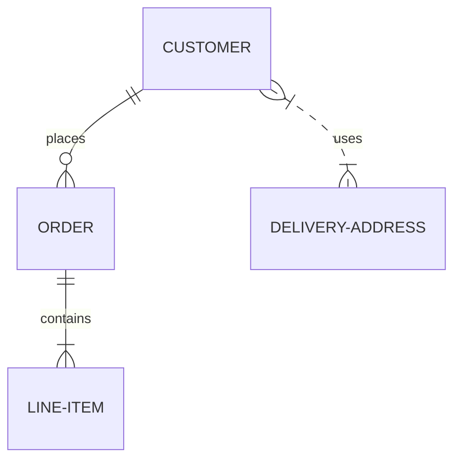
````

**Cardinality notation:**
- `||` — exactly one
- `o|` — zero or one
- `}|` — one or more
- `o{` — zero or more

**Line types:** `--` solid (identifying), `..` dashed (non-identifying)

**Attributes:**
```
CUSTOMER {
    string name PK
    string email
    int age
}
```

### 6. Gantt Chart

**Keyword:** `gantt`

````markdown
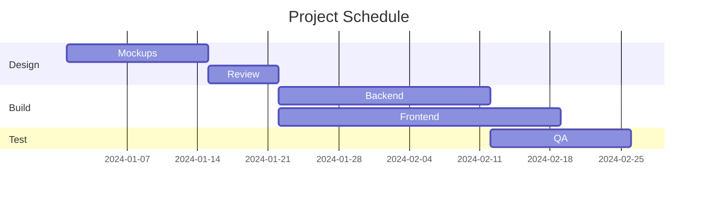
````

**Task modifiers:** `done`, `active`, `crit` (critical path), `milestone`

### 7. Pie Chart

**Keyword:** `pie`

````markdown
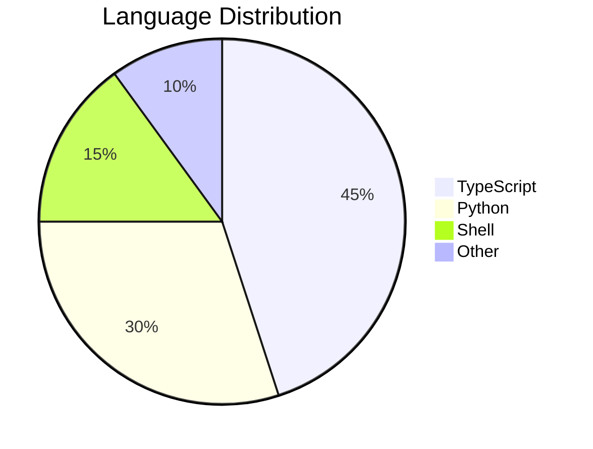
````

Values are relative — automatically computed as percentages.

### 8. Git Graph

**Keyword:** `gitGraph`

````markdown
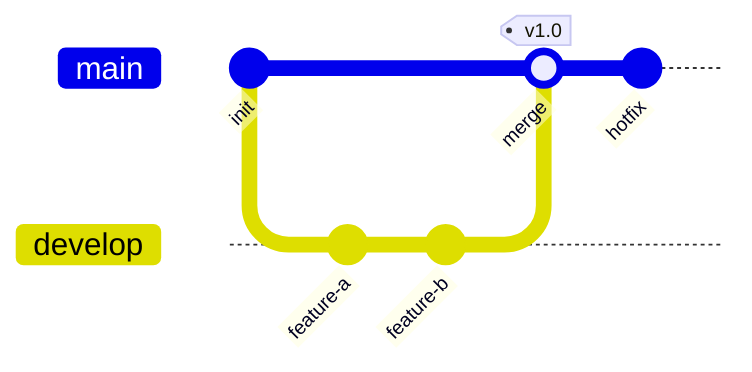
````

**Commands:** `commit`, `branch`, `checkout`, `merge`, `cherry-pick`

### 9. User Journey

**Keyword:** `journey`

````markdown
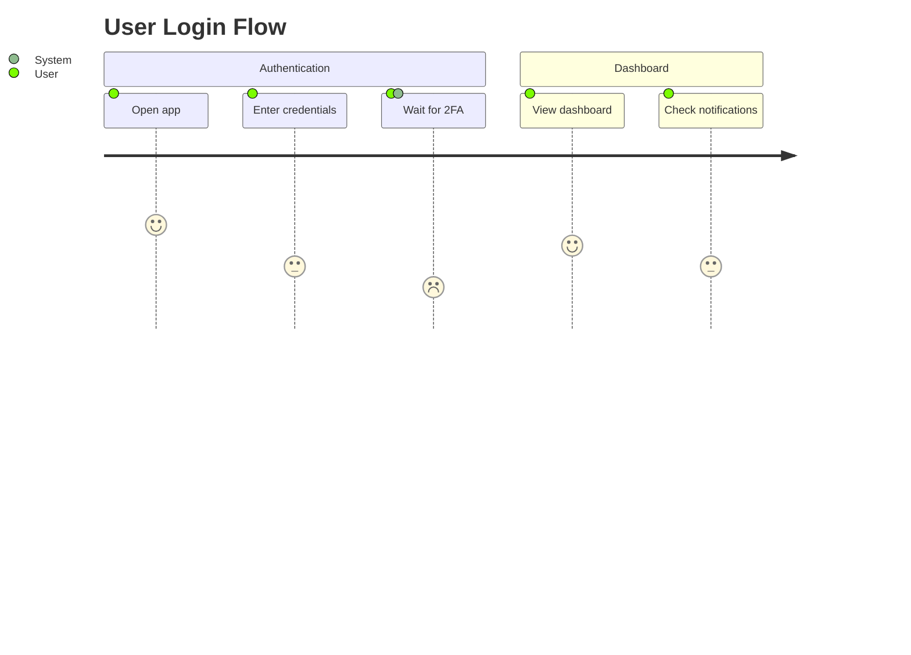
````

Score is 1-5 (1 = frustrating, 5 = great). Actors listed after score.

### 10. Mindmap

**Keyword:** `mindmap`

````markdown
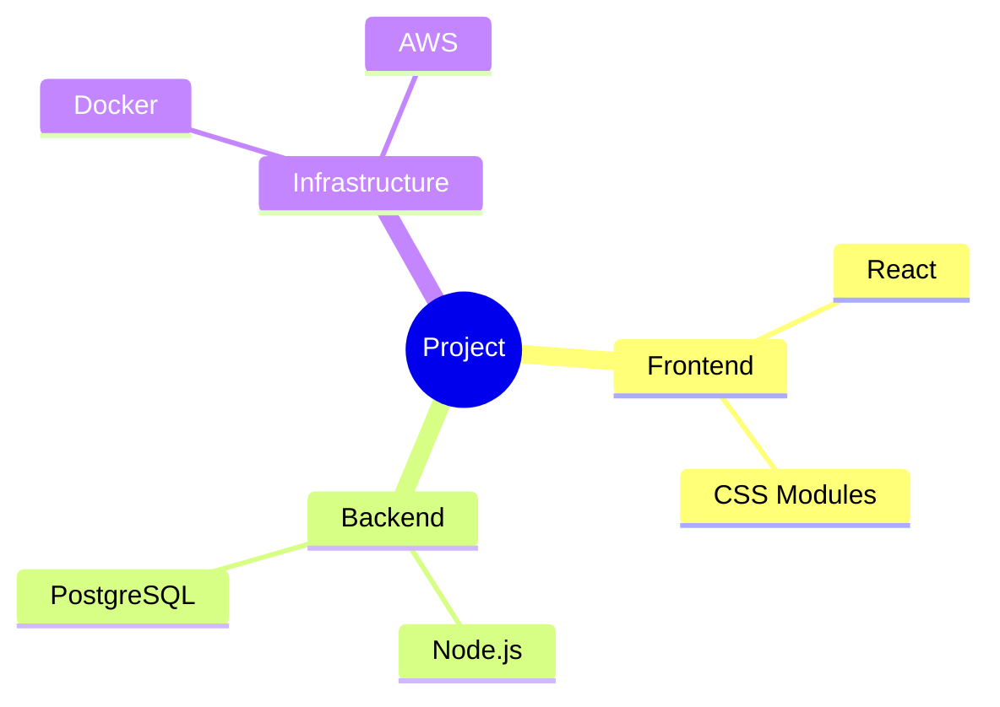
````

Hierarchy is indentation-based. Root can use shapes: `((circle))`, `[square]`, `(rounded)`.

### 11. Timeline

**Keyword:** `timeline`

````markdown
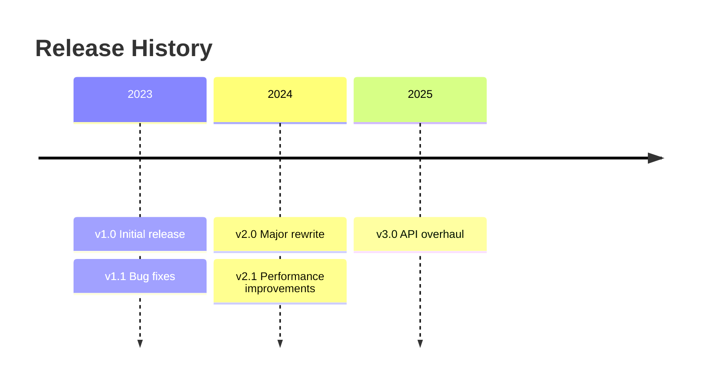
````

### 12. Quadrant Chart

**Keyword:** `quadrantChart`

````markdown
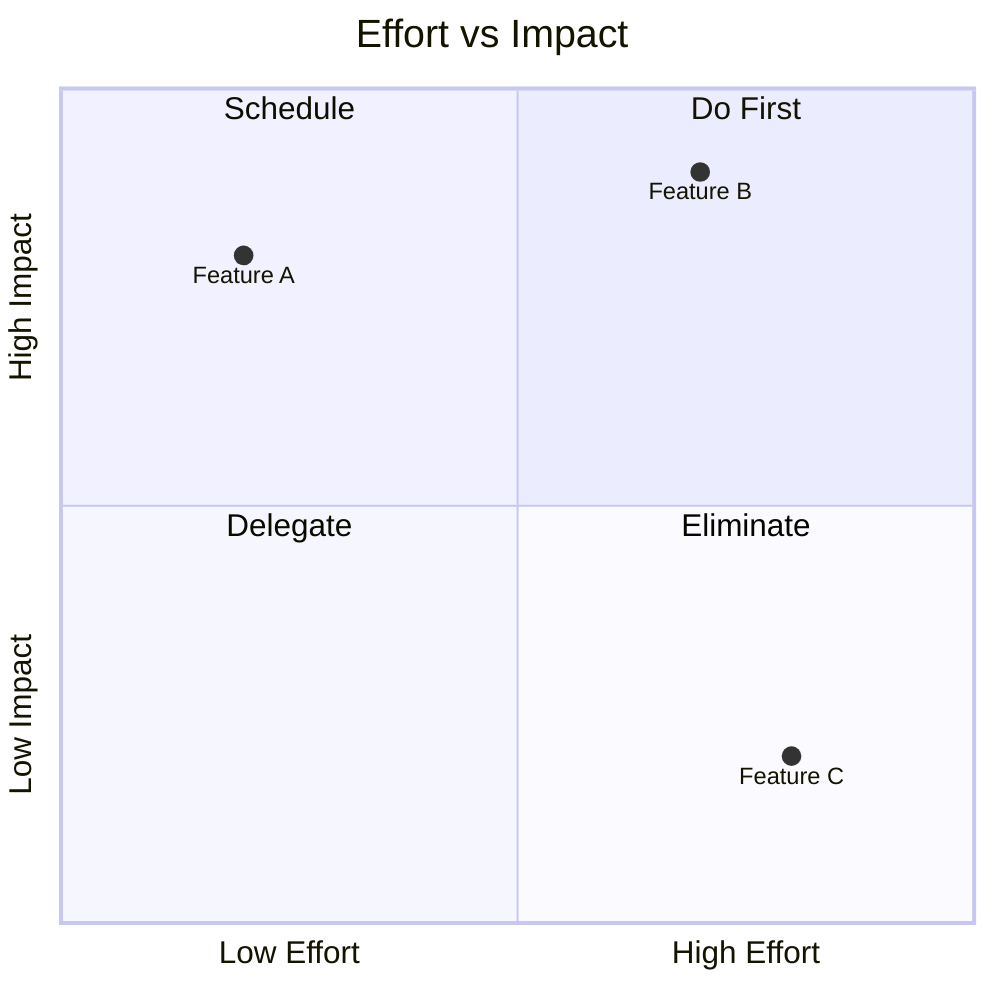
````

Coordinates are [0,1] range for both axes.

### 13. Sankey Diagram

**Keyword:** `sankey-beta` (use `-beta` on GitHub)

````markdown
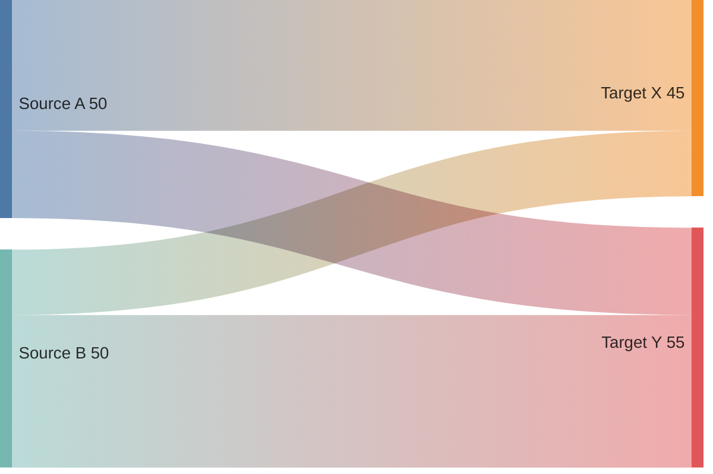
````

CSV format: source, target, value. Blank lines between rows are fine.

### 14. XY Chart

**Keyword:** `xychart-beta` (use `-beta` on GitHub)

````markdown
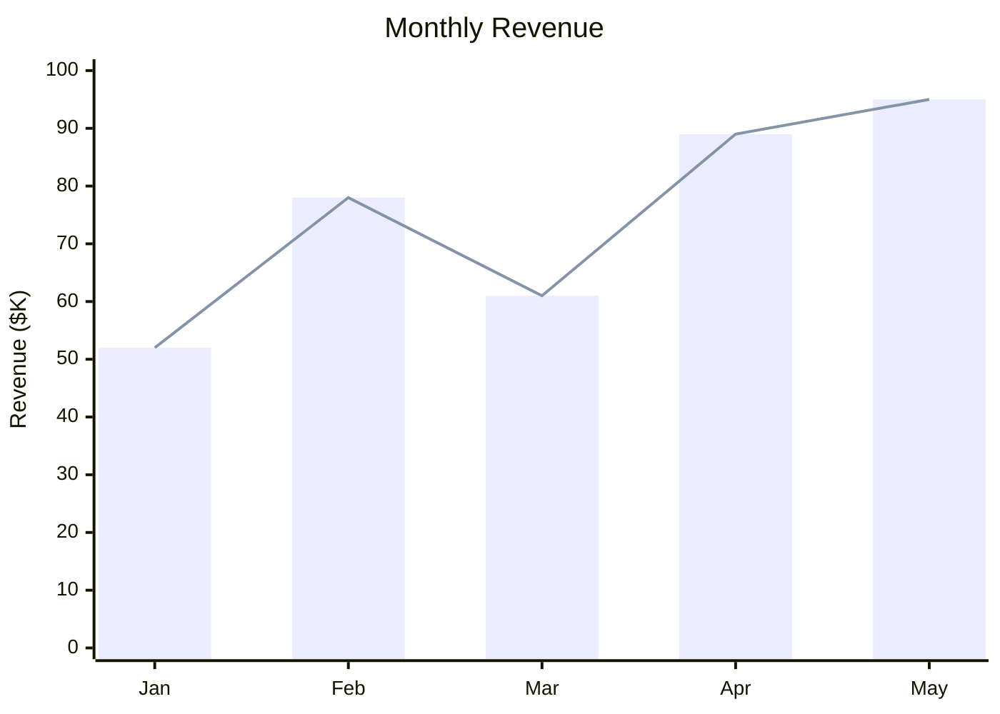
````

Supports `bar` and `line` series. Use `xychart-beta horizontal` for horizontal.

### 15. Block Diagram

**Keyword:** `block-beta` (use `-beta` on GitHub)

````markdown
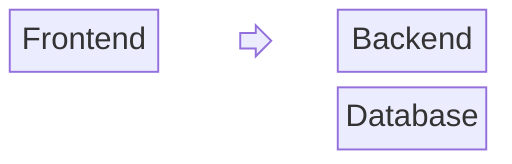
````

Grid-based layout with `columns N`. `space` creates empty cells. `space:2` spans two.

### 16. C4 Context Diagram

**Keyword:** `C4Context` / `C4Container` / `C4Component` / `C4Dynamic` / `C4Deployment`

````markdown
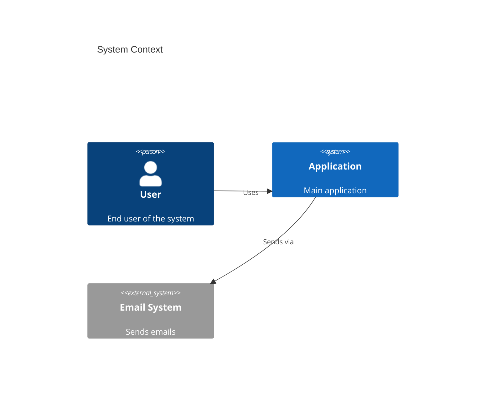
````

### 17. Requirement Diagram

**Keyword:** `requirementDiagram`

````markdown
```mermaid
requirementDiagram
    requirement test_req {
        id: REQ-01
        text: System shall respond in <100ms
        risk: high
        verifymethod: test
    }
    element test_entity {
        type: simulation
    }
    test_entity - satisfies -> test_req
```
````

### 18. Packet Diagram (v11+, uncertain on GitHub)

**Keyword:** `packet-beta`

````markdown
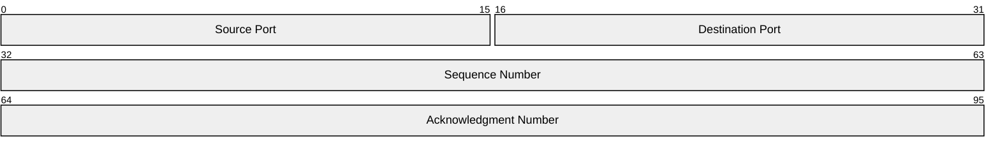
````

### 19. Architecture Diagram (v11.1+, uncertain on GitHub)

**Keyword:** `architecture-beta`

````markdown

````

Built-in icons: `cloud`, `database`, `server`, `disk`, `internet`.
